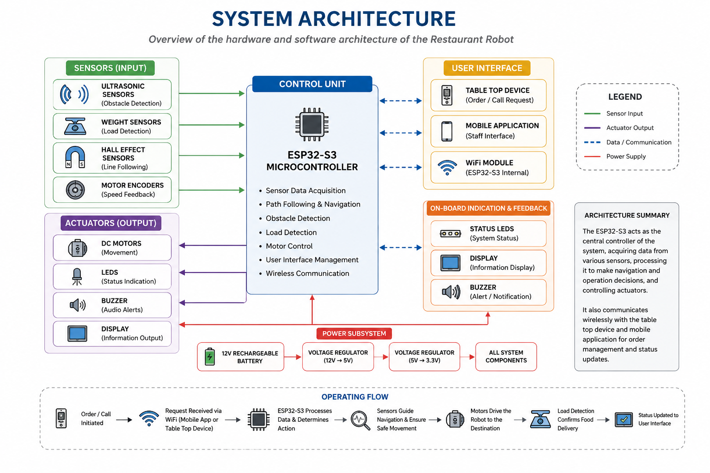
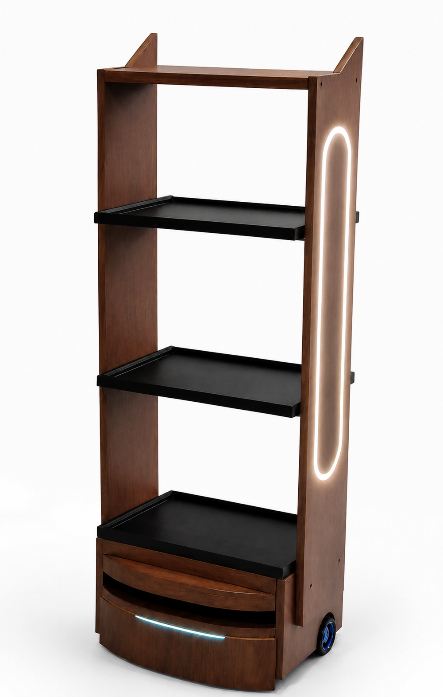
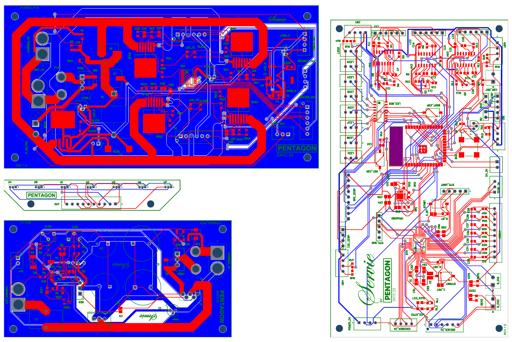
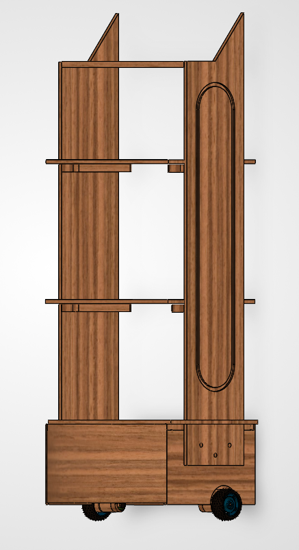

# 🤖 Autonomous Restaurant Service Robot

> An autonomous restaurant delivery robot developed to automate food delivery within indoor environments using magnetic-guided navigation, wireless communication, and embedded control systems.

---

## 📌 Overview

This project presents an autonomous service robot capable of navigating predefined paths inside restaurants while carrying food safely and efficiently. The robot integrates embedded systems, custom PCB design, motor control, wireless communication, and a mobile application into a complete autonomous platform.

### Key Features

- Autonomous restaurant delivery
- Magnetic path following using Hall-effect sensors
- Dual microcontroller architecture (ESP32-S3 + STM32)
- PID-based motor control
- Wireless communication
- Mobile application interface
- Obstacle detection
- Autonomous charging dock
- Custom-designed PCBs
- Custom enclosure design

---

## 🏗 System Architecture

<p align="center">

</p>

---

## 📷 Project Gallery

### Final Robot

<p align="center">

</p>

### PCB Design

<p align="center">

</p>

### Enclosure Design

<p align="center">

</p>

---

## 🛠 Technologies

### Embedded Systems

- ESP32-S3
- STM32
- Embedded C
- Arduino Framework

### Electronics

- Altium Designer
- Custom PCB Design
- Hall Effect Sensors
- Motor Drivers

### Mechanical Design

- SolidWorks
- Custom Enclosure Design

## Architecture

```text
React/Vite web app --HTTP--> ESP32 --UART 115200 8N1--> STM32F103C8Tx
```

- `webapp/` contains the React dashboard. It connects to the ESP32 API at
  `http://192.168.4.1` by default.
- `firmware/esp32/` contains the Arduino sketch responsible for Wi-Fi, HTTP API,
  weight sensing, obstacle sensing, LEDs, and communication with the STM32.
- `firmware/stm32/` contains the STM32CubeIDE project responsible for line
  following, route execution, motors, encoders, Hall sensors, and docking.

## STM32 project

Target: STM32F103C8Tx

Import `firmware/stm32` with:

1. Open STM32CubeIDE and select a workspace outside this repository.
2. Select **File > Import > General > Existing Projects into Workspace**.
3. Select the `firmware/stm32` directory.
4. Leave **Copy projects into workspace** unchecked.
5. Build and flash using the appropriate hardware debugger.

The CubeMX configuration is `pentagon_new.ioc`.

## ESP32 project

Open `firmware/esp32/esp32_robot_api_led_control_v13.ino` with the Arduino IDE.
Select the exact installed ESP32 board before compiling. In addition to the
ESP32 Arduino core, the sketch requires these libraries:

- HX711
- Adafruit NeoPixel

The ESP32 communicates with the STM32 through UART1 at 115200 baud:

- ESP32 RX: GPIO 18
- ESP32 TX: GPIO 17

## Web application

Requires Node.js and npm.

```powershell
cd webapp
npm install
npm run dev
```

For a production build:

```powershell
npm run build
```

Connect the controlling device to `RestaurantRobot_AP`, then open the dashboard
and use `http://192.168.4.1` as the ESP32 address.

## Safety and configuration

- Test motion changes with the wheels raised or motors mechanically isolated
  before floor testing.
- Confirm that the stop command and obstacle handling work before route tests.
- Pin assignments and calibration constants currently live in the firmware
  source files.
- The ESP32 firmware currently contains a development access-point password.
  Replace it with a deployment-specific secret before operating in a public
  environment, and do not commit real venue Wi-Fi credentials.

---

## 📁 Repository Structure

```text
Autonomous-Restaurant-Service-Robot/
│
├── docs/
│   ├── figures/
│   ├── reports/
│   ├── schematics/
│   └── working_videos/
│
├── hardware/
│   ├── enclosure/
│   ├── pcb-design/
│   └── pcb-3d-models/
│
├── firmware/
│   ├── esp32/
│   ├── stm32/
│   └── arduino/
│
├── mobile-app/
│
├── README.md
├── LICENSE
└── .gitignore
```

---

## 📄 Documentation

Project documentation can be found in:

- Final Report
- Final Presentation
- Project Pitch
- PCB Schematics
- Working Videos

located under the **docs/** directory.

---

## 👥 Team Members

- **Abishek L.**
- **Santhosh S.**
- **Umair A.**
- **Hakam M. R. A.**
- **Nuwanaka W. A. S.**

---

